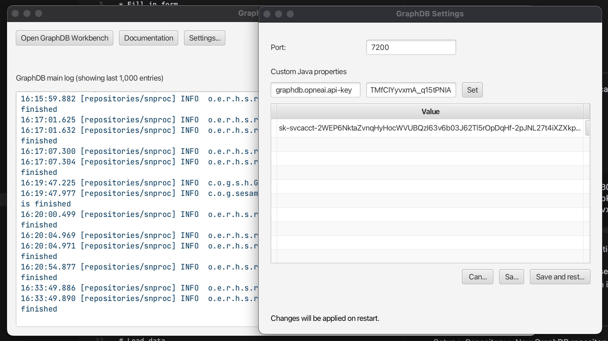
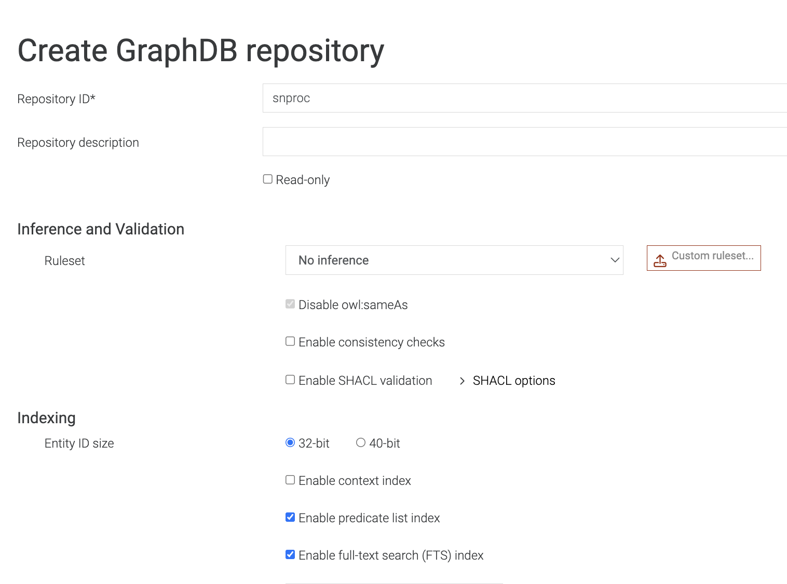
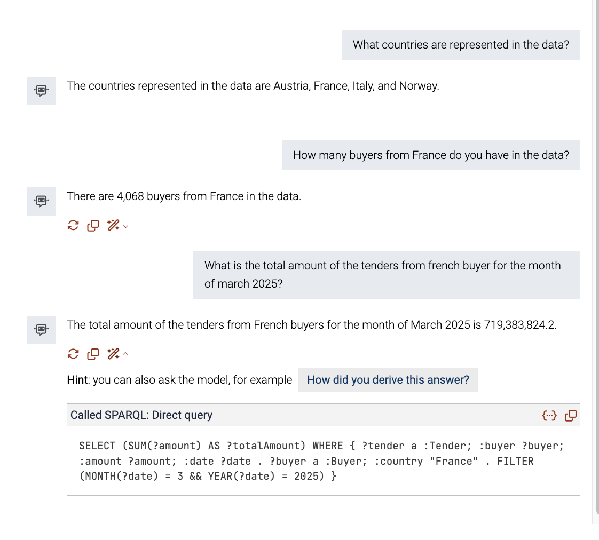

# TTYG demo Instructions

These are detailed instructuions how to set up the DataWeek 2025 Talk To Your Graph demo locally

TTYG [documentation](https://graphdb.ontotext.com/documentation/11.0/talk-to-graph.html)

* Download GraphDB from [download page](https://www.ontotext.com/products/graphdb/#try-graphdb)
* Fill in form 
* Install distribution for your OS
* Launch GraphDB

# Add OpenAI creds

You neeed to add a custom java property with the OpenAI credentials. 
Easiest is to do it from the system dialog of the desktop application. 

* In the dialog click `Settings` 
* add key value pair
* click `Set` > `Save And Restart`



* key: 
```
graphdb.openai.api-key
```
* value: 
```
Your OpenAI Api Key (or ask Nikola) 
```

See [doc](https://graphdb.ontotext.com/documentation/11.0/directories-and-config-properties.html#configuration) for other means of setting configuration variables.  


# Create a repository 

From the main menu on the left: 
`Setup` > `Repository` > `New GraphDB repository` 

- name `snproc`
- chose ruleset `No Inference`
- check box to enable FTS 



# Load data 

From the main menu on the left: `Import` > `Get RDF data from URL` 

Paste this link 
```
https://github.com/enRichMyData/sn-ttyg-demo/raw/refs/heads/master/sn-chatbot/data/out/snproc.data.trig.zip
``` 

Import with default settings,
Takes about a minute

# Create the agent

From the main menu on the left: `Lab` > `Talk To Your Graph`

Click the plus sign on the right --> `creata a new agent` 

* give it a name (i.e `snproc-chatbot`)
* choose 'snproc' repo
* choose 'Query method' --> 'SPARQL' --> 'Fetch ontology from named graph' and paste  the URI below

```
http://sndemo.ontotext.com/ontology/
```

* check "Full-text search in labels fo IRI dicovery"

Thes chatbot is now configured to generate SPARQL queries,
based on ther ontology and use them to query the data 

note that the ontology is generaed by [ontology-subset-insert.ru](data/model/ontology-subset-insert.ru)
it can be seen by pressing 'review agent instructions'

# Talk to your graph 

*Can get extremly slow due to OpenAI's new restrictions*

You can nowe converse with the data using the chatbot interface.

Use `explain response` button to see the generated query or ask `How did you come up with this answer?` for introspection

Here are some example questions: 

* What is in your database?`
* What countries are represented in the data?`
* How many buyers from France do you have in the data?
* What is the total amount of the tenders from french buyer for the month of march 2025?
* I am a producer of glass eprouvettes, help me find intersting tenders in France. 
  (Followup) Order all the buyers by department and by amount spent 


